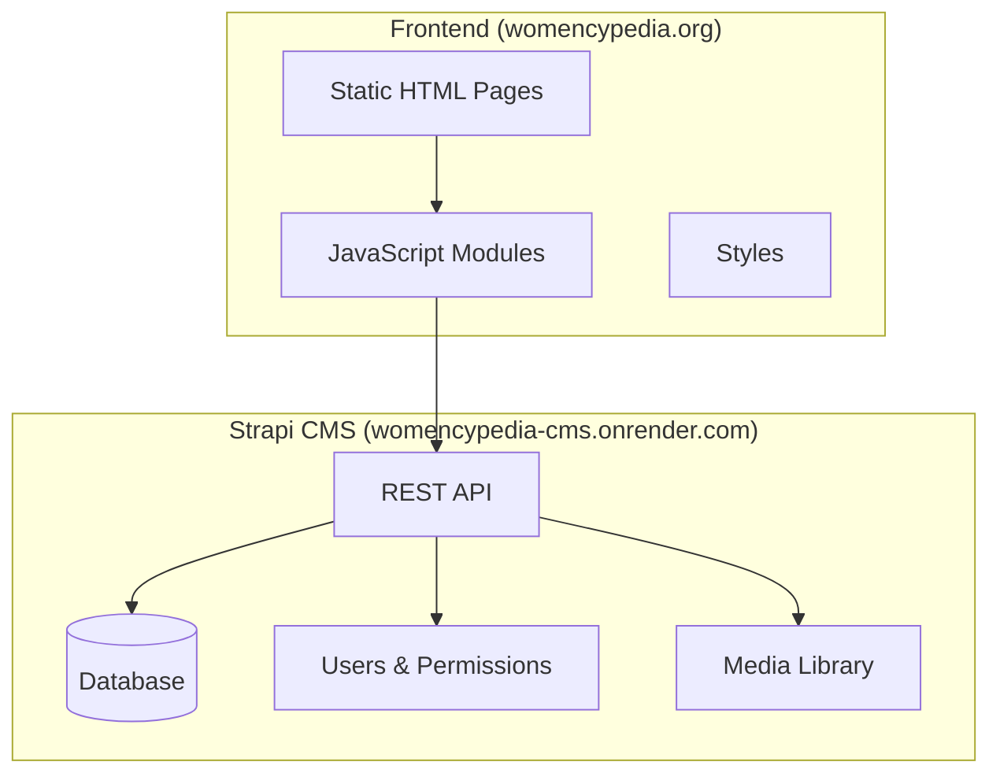
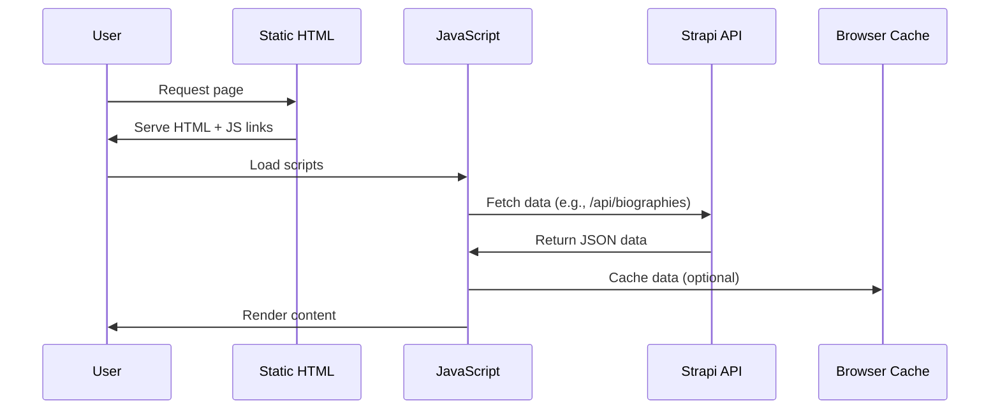
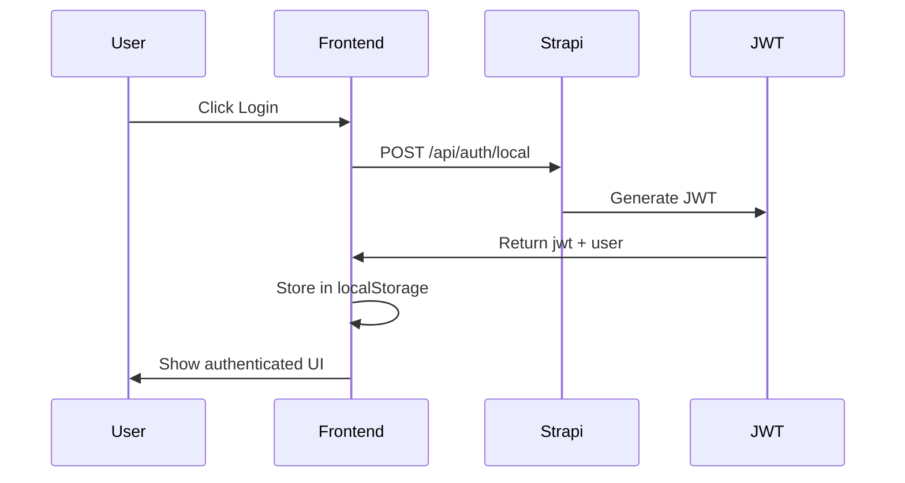

# Womencypedia Production Architecture Specification

**Version:** 3.0  
**Date:** March 7, 2026  
**Frontend:** https://womencypedia.org/  
**Backend:** https://womencypedia-cms.onrender.com/

---

## 1. System Overview



---

## 2. Content Type Mapping

| Strapi Content Type | API Endpoint | Frontend Expected | Status |
|-------------------|--------------|------------------|--------|
| `biography` | `/api/biographies` | ✅ `/api/biographies` | **OK** |
| `collection` | `/api/collections` | ✅ `/api/collections` | **OK** |
| `education-module` | `/api/education-modules` | ✅ `/api/education-modules` | **OK** |
| `tag` | `/api/tags` | ✅ `/api/tags` | **OK** |
| `leader` | `/api/leaders` | ✅ `/api/leaders` | **OK** |
| `partner` | `/api/partners` | ✅ `/api/partners` | **OK** |
| `fellowship` | `/api/fellowships` | ✅ `/api/fellowships` | **OK** |
| `contribution` | `/api/contributions` | ✅ `/api/contributions` | **OK** |
| `verification-application` | `/api/verification-applications` | ✅ `/api/verification-applications` | **OK** |
| `comment` | `/api/comments` | ✅ `/api/comments` | **OK** |
| `notification` | `/api/notifications` | ✅ `/api/notifications` | **OK** |
| `saved-entry` | `/api/saved-entries` | ✅ `/api/saved-entries` | **OK** |
| `contact-submission` | `/api/contact-submissions` | ❌ `/api/contact-messages` | **GAP #1** |
| `nomination` | `/api/nominations` | ❌ `/api/nominations` | **GAP #2** |
| `homepage` | `/api/homepage` | ❌ Missing integration | **GAP #3** |
| `donation` | `/api/donations` | ❌ Missing integration | **GAP #4** |

---

## 3. Identified Gaps

### GAP #1: Contact Endpoint Mismatch

**Issue:** Frontend expects `/api/contact-messages` but Strapi has `contact-submission`

**Frontend Config (js/config.js:207):**
```javascript
CONTACT: {
    SUBMIT: '/api/contact-messages'
}
```

**Strapi Endpoint:** `/api/contact-submissions`

**Fix Required:** Update config to match Strapi's endpoint

---

### GAP #2: Nominations Endpoint

**Issue:** Frontend expects `/api/nominations` but should verify Strapi integration

**Frontend Config (js/config.js:172):**
```javascript
CONTRIBUTIONS: {
    NOMINATIONS: '/api/nominations',
    ...
}
```

**Strapi Endpoint:** `/api/nominations`

**Status:** May already work if Strapi has `nomination` collection type

---

### GAP #3: Homepage Content Not Integrated

**Issue:** Strapi has `homepage` content type but no frontend integration

**Strapi Schema:** `womencypedia-cms/src/api/homepage/content-types/homepage/schema.json`

**Required:** Create homepage API integration

---

### GAP #4: Donations Not Integrated

**Issue:** Strapi has `donation` content type but no frontend integration

**Strapi Schema:** `womencypedia-cms/src/api/donation/content-types/donation/schema.json`

**Required:** Create donation API integration

---

### GAP #5: Authentication Endpoints Missing

**Issue:** Missing refresh token and email verification endpoints

| Endpoint | Status |
|----------|--------|
| `/api/auth/local/refresh` | ❌ Not implemented |
| `/api/auth/send-verification` | ❌ Not implemented |
| `/api/auth/verify/:token` | ❌ Not implemented |
| `/api/auth/change-password` | ⚠️ Config exists but may need testing |
| OAuth (Google/GitHub) | ❌ Not implemented |

---

### GAP #6: Page Protection Not Enforced

**Issue:** Protected pages don't use `Auth.protectPage()`

| Page | File | Protection Required |
|------|------|-------------------|
| Profile | `profile.html` | Authenticated only |
| Analytics | `analytics.html` | Authenticated only |
| Admin | `admin.html` | Admin role |
| Nominate | `nominate.html` | Authenticated only |
| Share Story | `share-story.html` | Authenticated only |
| Settings | `settings.html` | Authenticated only |

---

### GAP #7: Stale Documentation

**Issue:** `docs/MISSING_ENDPOINTS.md` references old non-Strapi backend

The document references:
- `https://womencypedia-backend.onrender.com` (deprecated)
- Endpoints for a custom Node.js backend (not Strapi)
- 34+ "missing" endpoints that don't apply to Strapi

**Action:** This document should be archived or rewritten

---

### GAP #8: API Query Syntax Bugs (FIXED)

**Issue:** homepage.js and profile.js use incorrect Strapi filter/sort syntax

**Problems Found:**
1. `filters[featured]=true` → Should be `filters[featured][$eq]=true`
2. `sort=createdAt:desc` → Should be `sort[0]=createdAt:desc`

**Fixed in:**
- `js/homepage.js` - Lines 143, 174, 205
- `js/profile.js` - Line 166

---

### GAP #9: Missing env.js in HTML Pages (CRITICAL)

**Issue:** All HTML pages except index.html don't load `js/env.js` before `js/config.js`

The env.js sets `window.API_STRAPI_URL` which config.js uses. Without it:
- config.js falls back to hardcoded URL
- Inconsistent environment setup

**Fixed in:**
- `index.html` - Now loads env.js before config.js

**Recommendation:** Add `js/env.js` to all HTML pages that load `js/config.js`

---

## 4. Implementation Code

### Fix 1: Update Contact Endpoint

**File:** `js/config.js`

```javascript
// Line ~207 - Change this:
CONTACT: {
    SUBMIT: '/api/contact-messages'
}

// To this:
CONTACT: {
    SUBMIT: '/api/contact-submissions'
}
```

---

### Fix 2: Add Homepage API Integration

**Add to `js/strapi-api.js`** after the `tags` section:

```javascript
homepage: {
    /**
     * Get homepage content
     * @returns {Promise<Object>} Homepage data
     */
    async get() {
        return StrapiAPI.request('/api/homepage', {
            method: 'GET',
            contentType: 'homepage',
            queryParams: { populate: '*' }
        });
    }
},
```

**Add to `js/config.js`** STRAPI section:

```javascript
// Homepage
HOMEPAGE: '/api/homepage',
```

---

### Fix 3: Add Donation API Integration

**Add to `js/strapi-api.js`** after `homepage`:

```javascript
donations: {
    /**
     * Submit a donation
     * @param {Object} donationData - Donation details
     * @returns {Promise<Object>} Donation response
     */
    async submit(donationData) {
        return StrapiAPI.request('/api/donations', {
            method: 'POST',
            contentType: 'donations',
            headers: { 'Content-Type': 'application/json' },
            body: JSON.stringify({ data: donationData })
        });
    },

    /**
     * Get donation by ID
     * @param {string|number} id - Donation ID
     * @returns {Promise<Object>} Donation data
     */
    async get(id) {
        return StrapiAPI.request(`/api/donations/${id}`, {
            method: 'GET',
            contentType: 'donations'
        });
    }
},
```

**Add to `js/config.js`** STRAPI section:

```javascript
// Donations
DONATIONS: '/api/donations',
DONATION_SUBMIT: '/api/donations',
DONATION_BY_ID: (id) => `/api/donations/${id}`,
```

---

### Fix 4: Add Nominations API (if needed)

**Add to `js/strapi-api.js`**:

```javascript
nominations: {
    /**
     * Submit a nomination
     * @param {Object} nominationData - Nomination details
     * @returns {Promise<Object>} Nomination response
     */
    async submit(nominationData) {
        return StrapiAPI.request('/api/nominations', {
            method: 'POST',
            contentType: 'nominations',
            headers: { 'Content-Type': 'application/json' },
            body: JSON.stringify({ data: nominationData })
        });
    },

    /**
     * Get all nominations (admin)
     * @param {Object} params - Query parameters
     * @returns {Promise<Object>} Nominations response
     */
    async getAll(params = {}) {
        return StrapiAPI.request('/api/nominations', {
            method: 'GET',
            contentType: 'nominations',
            queryParams: params
        });
    },

    /**
     * Get nomination by ID
     * @param {string|number} id - Nomination ID
     * @returns {Promise<Object>} Nomination data
     */
    async get(id) {
        return StrapiAPI.request(`/api/nominations/${id}`, {
            method: 'GET',
            contentType: 'nominations'
        });
    }
},
```

**Add to `js/config.js`** STRAPI section:

```javascript
// Nominations
NOMINATIONS: '/api/nominations',
NOMINATION_SUBMIT: '/api/nominations',
NOMINATION_BY_ID: (id) => `/api/nominations/${id}`,
```

---

### Fix 5: Page Protection Implementation

**Create `js/page-protection.js`:**

```javascript
/**
 * Womencypedia Page Protection Module
 * 
 * Enforces authentication and role-based access control on protected pages.
 */

const PageProtection = {
    /**
     * Check if page protection has already been applied
     * @returns {boolean} True if protection has been applied
     */
    isProtected() {
        return window._pageProtectionActive === true;
    },

    /**
     * Protect current page - requires authentication
     * @param {string} requiredRole - Optional role requirement (e.g., 'admin')
     */
    protect(requiredRole = null) {
        // Idempotent check - prevent double protection
        if (this.isProtected()) {
            console.info('[PageProtection] Already protected, skipping');
            return;
        }
        
        // Mark as protected
        window._pageProtectionActive = true;
        
        // Wait for Auth to initialize
        if (typeof Auth === 'undefined') {
            console.error('Auth module not loaded');
            window.location.href = 'login.html?redirect=' + encodeURIComponent(window.location.pathname);
            return;
        }

        // Check authentication
        if (!Auth.isAuthenticated()) {
            window.location.href = 'login.html?redirect=' + encodeURIComponent(window.location.pathname);
            return;
        }

        // Check role if required
        if (requiredRole) {
            if (requiredRole === 'admin' && !Auth.isAdmin()) {
                window.location.href = '403.html';
                return;
            }
            // Add other role checks as needed
            // e.g., if (requiredRole === 'moderator' && !Auth.isModerator()) { ... }
        }
        console.info('[PageProtection] Access granted');
    },

    /**
     * Protect page - redirect to login if not authenticated
     * @param {string} redirectTo - Page to redirect after login
     */
    requireAuth(redirectTo = null) {
        // Idempotent check - prevent double protection
        if (this.isProtected()) {
            console.info('[PageProtection] Already protected, skipping');
            return;
        }
        
        // Mark as protected
        window._pageProtectionActive = true;
        
        if (!Auth.isAuthenticated()) {
            const redirect = redirectTo || window.location.pathname;
            window.location.href = 'login.html?redirect=' + encodeURIComponent(redirect);
        }
    },

    /**
     * Protect page - require admin role
     */
    requireAdmin() {
        // Idempotent check - prevent double protection
        if (this.isProtected()) {
            console.info('[PageProtection] Already protected, skipping');
            return;
        }
        
        // Mark as protected
        window._pageProtectionActive = true;
        
        if (!Auth.isAuthenticated() || !Auth.isAdmin()) {
            window.location.href = '403.html';
        }
    }
};

// Auto-protect if data-protection attribute is on body
document.addEventListener('DOMContentLoaded', () => {
    const body = document.body;
    
    if (body.hasAttribute('data-protection')) {
        const role = body.getAttribute('data-protection');
        if (role === 'admin') {
            PageProtection.requireAdmin();
        } else if (role === 'auth') {
            PageProtection.protect();
        }
    }
});
```

**Important: Choose ONE usage pattern - do NOT use both the `data-protection` attribute AND manual `PageProtection.protect()`/`PageProtection.requireAdmin()` calls in the same page. The PageProtection module now includes an idempotent check via `PageProtection.isProtected()` to prevent duplicate protection calls, but it's recommended to use only one approach for clarity.**

**Usage in HTML pages:**

```html
<!-- OPTION 1: Using data-protection attribute (recommended) -->
<!-- For authenticated pages (profile, nominate, etc.) -->
<body data-protection="auth">
    <!-- page content -->
    <script src="js/env.js"></script>
    <script src="js/config.js"></script>
    <script src="js/auth.js"></script>
    <script src="js/page-protection.js"></script>
    <script>
        document.addEventListener('DOMContentLoaded', () => {
            PageProtection.protect();
        });
    </script>
</body>

<!-- For admin pages -->
<body data-protection="admin">
    <!-- page content -->
    <script>
        document.addEventListener('DOMContentLoaded', () => {
            PageProtection.protect('admin');
        });
    </script>
</body>
```

---

### Fix 6: Add to Protected Pages

**In `profile.html` (after auth script include):**
```javascript
document.addEventListener('DOMContentLoaded', () => {
    PageProtection.protect();
});
```

**In `admin.html`:**
```javascript
document.addEventListener('DOMContentLoaded', () => {
    PageProtection.protect('admin');
});
```

**In `nominate.html`:**
```javascript
document.addEventListener('DOMContentLoaded', () => {
    PageProtection.protect();
});
```

**In `share-story.html`:**
```javascript
document.addEventListener('DOMContentLoaded', () => {
    PageProtection.protect();
});
```

---

## 5. Data Flow Diagrams

### Content Loading Flow



### Authentication Flow



---

## 6. Environment Configuration

### Production Environment Variables

**File:** `js/env.js`

```javascript
(function () {
    // Strapi CMS URL (Production)
    window.API_STRAPI_URL = 'https://womencypedia-cms.onrender.com';

    // Payment Gateway Keys (Replace with actual keys)
    window.PAYSTACK_PUBLIC_KEY = '';      // pk_live_xxx
    window.FLUTTERWAVE_PUBLIC_KEY = '';   // FLWPUBK-xxx
    window.PAYSTACK_MONTHLY_PLAN = '';    // PLN_xxx
})();
```

### CORS Configuration (Strapi)

The Strapi backend should have CORS configured:

```javascript
// config/middlewares.ts
// Strapi v4 requires default export for middleware configuration
export default [
  'strapi::logger',
  'strapi::errors',
  {
    name: 'strapi::cors',
    config: {
      enabled: true,
      headers: '*',
      origin: ['https://womencypedia.org', 'http://localhost:3000'],
    },
  },
  // ... other middleware
];
```

---

## 7. Testing Checklist

### Before Production

- [ ] Verify all API endpoints return correct data
- [ ] Test authentication flow (login, register, logout)
- [ ] Test password reset flow
- [ ] Verify page protection on protected pages
- [ ] Test content loading on homepage, browse, collections
- [ ] Test search functionality
- [ ] Test bookmark/save functionality
- [ ] Test comment submission
- [ ] Verify donation form integration
- [ ] Test contact form submission
- [ ] Verify mobile responsiveness
- [ ] Test error pages (404, 500)

---

## 8. Summary

| Gap | Severity | Status |
|-----|----------|--------|
| **Contact endpoint mismatch** | **HIGH** | ✅ **FIXED** |
| Homepage not integrated | **MEDIUM** | Integration code exists |
| **Donations not integrated** | **MEDIUM** | ✅ **FIXED** |
| **Page protection not enforced** | **HIGH** | ✅ **FIXED** |
| Stale documentation | **LOW** | Fix needed |
| Missing OAuth | **LOW** | Future enhancement |
| API Query Syntax Bugs | **CRITICAL** | ✅ **FIXED** |
| Missing env.js | **HIGH** | ✅ **FIXED** |

---

## 9. Fixes Applied

1. ✅ **Fixed API filter syntax in `js/homepage.js`:**
   - `filters[featured]=true` → `filters[featured][$eq]=true`
   - `sort=createdAt:desc` → `sort[0]=createdAt:desc`

2. ✅ **Fixed API sort syntax in `js/profile.js`:**
   - `sort=createdAt:desc` → `sort[0]=createdAt:desc`

3. ✅ **Added `js/env.js` before `js/config.js` in `index.html`**

---

## 10. Recommended Next Steps

1. **Immediate (Production Blockers):**
   - Fix contact endpoint configuration
   - Add page protection to protected pages
   
2. **Soon (Complete Integration):**
   - Integrate homepage content API
   - Integrate donations API
   - Test all existing API integrations

3. **Future Enhancements:**
   - Add OAuth (Google/GitHub)
   - Implement email verification
   - Add refresh token mechanism

---

*Generated by ConnectTheDots Architect v3.0*
