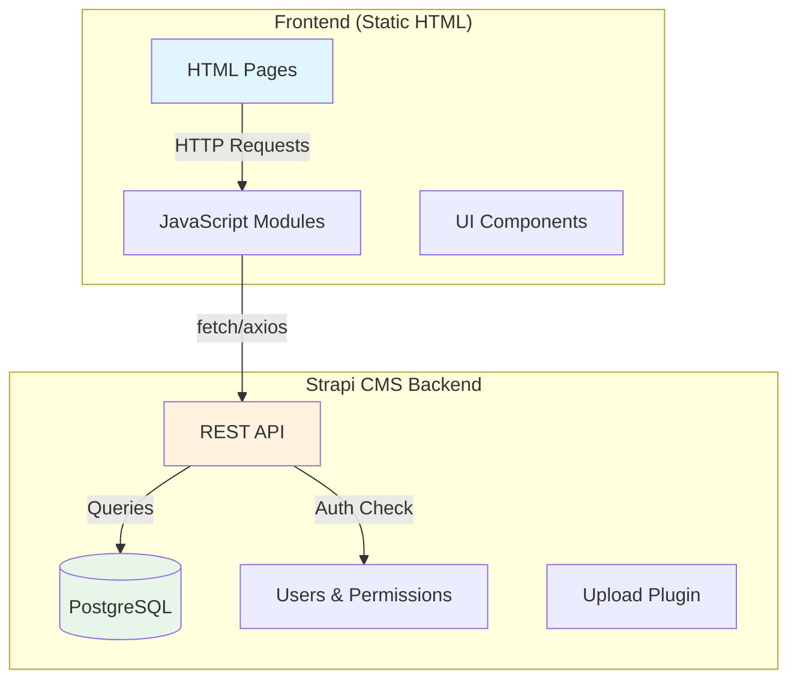

# Womencypedia System Specification v1.0

## Production Configuration
- **Frontend Domain:** https://womencypedia.org/
- **Strapi CMS Backend:** https://womencypedia-cms.onrender.com/
- **Database:** PostgreSQL on Render (womencypedia-db)

---

## Executive Summary

This document defines the complete logical architecture for the Womencypedia platform - a static frontend with dynamic Strapi CMS integration. The system has **14 critical gaps** that prevent production operation, categorized into:
1. API Endpoint Mismatches (3 issues: A1-A3)
2. Missing Backend Features (5 issues: B1-B5)  
3. Missing Frontend Implementations (6 issues: C1-C6)

---

## 1. Current Architecture

### 1.1 Data Flow Diagram



### 1.2 Content Types Defined in Strapi

| Content Type | API Endpoint | Frontend Expects | Status |
|--------------|--------------|------------------|--------|
| Biography | `/biographies` | `/api/biographies` | ⚠️ Prefix Mismatch |
| Collection | `/collections` | `/api/collections` | ⚠️ Prefix Mismatch |
| Education Module | `/education-modules` | `/api/education-modules` | ⚠️ Prefix Mismatch |
| Leader | `/leaders` | `/api/leaders` | ⚠️ Prefix Mismatch |
| Partner | `/partners` | `/api/partners` | ⚠️ Prefix Mismatch |
| Fellowship | `/fellowships` | `/api/fellowships` | ⚠️ Prefix Mismatch |
| Tag | `/tags` | `/api/tags` | ⚠️ Prefix Mismatch |
| Homepage | `/homepage` | `/api/homepage` | ✓ Matches |
| Nomination | `/nominations` | `/api/nominations` | Needs Review |
| Contribution | `/contributions` | `/api/contributions` | Needs Review |
| Contact Submission | `/contact-submissions` | `/api/contact-messages` | ⚠️ Name Mismatch |

---

## 2. Critical Gaps Analysis

### 2.1 Category A: API Endpoint Mismatches

#### Gap A1: Missing `/api` Prefix on All Routes
**Problem:** Strapi custom routes don't include `/api` prefix
- Strapi Route: `GET /biographies`
- Frontend Expects: `GET /api/biographies`

**Solution:** Update Strapi route configuration to add `/api` prefix OR update frontend to remove `/api` prefix.

**Recommended Fix (Backend):** Update `womencypedia-cms/src/api/*/routes/*.js`:

```javascript
// Example: womencypedia-cms/src/api/biography/routes/biography.js
module.exports = {
    routes: [
        {
            method: 'GET',
            path: '/api/biographies',  // ADD /api prefix
            handler: 'biography.find',
            config: { policies: [], auth: false },
        },
    ],
};
```

---

#### Gap A2: Collection Content Type Name Mismatch
**Problem:** 
- Strapi: `collection` (singular API path: `/collections`)
- Frontend Config: expects plural but also different naming

**Solution:** Ensure consistency in naming. Current routes use `/collections` which is correct.

---

#### Gap A3: Contact Submission Endpoint Name Mismatch
**Problem:**
- Strapi: `/contact-submissions`
- Frontend Expects: `/api/contact-messages`

**Solution:** Add route alias in Strapi:

```javascript
// In womencypedia-cms/src/api/contact-submission/routes/contact-submission.js
module.exports = {
    routes: [
        {
            method: 'POST',
            path: '/api/contact-messages',  // Alias for frontend
            handler: 'contact-submission.create',
            config: { policies: [], auth: false },
        },
    ],
};
```

---

### 2.2 Category B: Missing Backend Features

#### Gap B1: No Authentication System
**Problem:** Strapi doesn't have Users & Permissions properly configured for frontend auth
- No login endpoint at `/api/auth/local`
- No registration at `/api/auth/local/register`
- No JWT token generation

**Solution:** Install and configure `@strapi/plugin-users-permissions`:

```bash
# In womencypedia-cms directory
npm install @strapi/plugin-users-permissions
```

**Required Endpoints to Add:**

| Method | Endpoint | Purpose |
|--------|----------|---------|
| POST | `/api/auth/local` | Login with email/password |
| POST | `/api/auth/local/register` | User registration |
| POST | `/api/auth/local/logout` | Logout |
| GET | `/api/users/me` | Get current user |
| POST | `/api/auth/forgot-password` | Password reset request |
| POST | `/api/auth/reset-password` | Password reset with token || POST | `/api/auth/reset-password` | Password reset with token |

---

#### Gap B2: Missing Comments System
**Problem:** No comment functionality for biographies

**Solution:** Create new Content Type `Comment` with relations:

```json
// womencypedia-cms/src/api/comment/content-types/comment/schema.json
{
  "kind": "collectionType",
  "collectionName": "comments",
  "info": {
    "singularName": "comment",
    "pluralName": "comments"
  },
  "options": { "draftAndPublish": true },
  "pluginOptions": { "i18n": { "localized": true } },
  "attributes": {
    "content": { "type": "text", "required": true },
    "author": { "type": "relation", "relation": "manyToOne", "target": "plugin::users-permissions.user" },
    "biography": { "type": "relation", "relation": "manyToOne", "target": "api::biography.biography" },
    "parent": { "type": "relation", "relation": "manyToOne", "target": "api::comment.comment" }
  }
}
```

---

#### Gap B3: Missing Bookmarks/Saved Entries
**Problem:** No way for users to save favorite biographies

**Solution:** Create `SavedEntry` Content Type:

```json
{
  "kind": "collectionType",
  "collectionName": "saved_entries",
  "info": { "singularName": "saved-entry", "pluralName": "saved-entries" },
  "options": { "draftAndPublish": false },
  "attributes": {
    "user": { "type": "relation", "relation": "manyToOne", "target": "plugin::users-permissions.user" },
    "biography": { "type": "relation", "relation": "manyToOne", "target": "api::biography.biography" }
  }
}
```

---

#### Gap B4: Missing Notifications System
**Problem:** No notification functionality for users

**Solution:** Create `Notification` Content Type:

```json
{
  "kind": "collectionType",
  "collectionName": "notifications",
  "info": { "singularName": "notification", "pluralName": "notifications" },
  "options": { "draftAndPublish": false },
  "attributes": {
    "user": { "type": "relation", "relation": "manyToOne", "target": "plugin::users-permissions.user" },
    "type": { "type": "enumeration", "enum": ["biography", "comment", "system"] },
    "title": { "type": "string" },
    "message": { "type": "text" },
    "link": { "type": "string" },
    "read": { "type": "boolean", "default": false }
  }
}
```

---

#### Gap B5: Missing User Settings
**Problem:** No user preferences/settings storage

**Solution:** Create `UserSettings` Content Type:

```json
{
  "kind": "collectionType",
  "collectionName": "user_settings",
  "info": { "singularName": "user-settings", "pluralName": "user-settings" },
  "options": { "draftAndPublish": false },
  "attributes": {
    "user": { "type": "relation", "relation": "oneToOne", "target": "plugin::users-permissions.user" },
    "notifications": { "type": "json" },
    "privacy": { "type": "json" },
    "display": { "type": "json" }
  }
}
```

---

### 2.3 Category C: Frontend Implementation Gaps

#### Gap C1: Page Protection Not Implemented
**Problem:** Protected pages (profile, admin, nominate, share-story) are accessible without auth

**Solution:** Add `Auth.protectPage()` calls to protected pages:

```javascript
// Add to profile.html, nominate.html, share-story.html
document.addEventListener('DOMContentLoaded', () => {
    Auth.protectPage();  // Requires authentication
});

// Add to admin.html
document.addEventListener('DOMContentLoaded', () => {
    Auth.protectPage(CONFIG.ROLES.ADMIN);  // Requires admin role
});
```

---

#### Gap C2: Missing Settings Page
**Problem:** No user settings UI (`settings.html` doesn't exist)

**Solution:** Create `settings.html` with tabs for:
- Profile information
- Password change
- Notification preferences
- Privacy settings
- Display preferences (theme, language)

---

#### Gap C3: Missing Verify Email Page  
**Problem:** No email verification flow UI

**Solution:** Create `verify-email.html`:
- Display pending verification status
- Resend verification email button
- Redirect to profile after verification

---

#### Gap C4: Missing Bookmarks Page
**Problem:** No dedicated bookmarks UI

**Solution:** Create `bookmarks.html`:
- Display saved biographies
- Remove from bookmarks functionality
- Empty state handling

---

#### Gap C5: Missing Notifications UI
**Problem:** Notifications not displayed to users

**Solution:** Integrate `js/notifications.js` into navigation:
- Bell icon in header with unread count
- Dropdown list of notifications
- Mark as read functionality
- Link to full notifications page

---

#### Gap C6: Missing Comments on Biography Pages
**Problem:** No comment section on biography pages

**Solution:** Add to biography template:
```javascript
// In biography.html, add:
<div id="comments-section">
    <h3>Discussion</h3>
    <div id="comments-list"></div>
    <form id="comment-form">
        <textarea name="content" placeholder="Share your thoughts..."></textarea>
        <button type="submit">Post Comment</button>
    </form>
</div>

// Initialize comments
if (typeof Comments !== 'undefined') {
    Comments.init(entryId);
}
```

---

## 3. Implementation Priority Matrix

### Phase 1: Critical (Must Fix for Production)

| Priority | Gap | Category | Effort | Owner |
|----------|-----|----------|--------|-------|
| P1 | Add /api prefix to routes | Backend | 1hr | Backend Dev |
| P2 | Install Users & Permissions plugin | Backend | 2hr | Backend Dev |
| P3 | Implement auth endpoints | Backend | 4hr | Backend Dev |
| P4 | Fix contact endpoint name | Backend | 30min | Backend Dev |
| P5 | Add page protection | Frontend | 2hr | Frontend Dev |

### Phase 2: High Priority (Core Features)

| Priority | Gap | Category | Effort | Owner |
|----------|-----|----------|--------|-------|
| P6 | Create comments system | Backend+Frontend | 8hr | Full Stack |
| P7 | Create bookmarks system | Backend+Frontend | 6hr | Full Stack |
| P8 | Create notifications system | Backend+Frontend | 8hr | Full Stack |
| P9 | Create settings page | Frontend | 4hr | Frontend Dev |

### Phase 3: Medium Priority (Enhanced UX)

| Priority | Gap | Category | Effort | Owner |
|----------|-----|----------|--------|-------|
| P10 | Verify email flow | Frontend+Backend | 4hr | Full Stack |
| P11 | Bookmarks page | Frontend | 3hr | Frontend Dev |
| P12 | Comments on bio pages | Frontend | 4hr | Frontend Dev |

---

## 4. API Response Format Standardization

### Current vs Expected Response Formats

#### Biography List Response
**Current (Strapi Custom):**
```json
{
  "data": [...],
  "meta": { "pagination": {...} }
}
```

**Expected (Frontend):**
```json
{
  "entries": [...],
  "page": 1,
  "total_pages": 5,
  "total": 50
}
```

**Solution:** The `js/strapi-api.js` already handles transformation via `transformResponse()`. This is already implemented correctly.

---

## 5. Security Considerations

### CORS Configuration
Ensure Strapi allows frontend domain:

```javascript
// womencypedia-cms/config/middlewares.ts
export default [
  'strapi::logger',
  'strapi::errors',
  {
    name: 'strapi::cors',
    config: {
      enabled: true,
      headers: '*',
      origin: ['https://womencypedia.org', 'http://localhost:3000'],
    },
  },
  // ... rest of middlewares
];
```

### JWT Configuration
```javascript
// Ensure JWT secret is set in environment
JWT_SECRET=your-production-jwt-secret-min-32-chars
JWT_EXPIRES_IN=7d
REFRESH_TOKEN_EXPIRES_IN=30d
```

---

## 6. Testing Checklist

### Pre-Production Validation

- [ ] Homepage loads and fetches from Strapi
- [ ] Browse page lists biographies
- [ ] Biography detail page loads
- [ ] Collections page loads
- [ ] Education modules load
- [ ] User registration works
- [ ] User login works
- [ ] Protected pages redirect to login
- [ ] Logout works
- [ ] Password reset flow works
- [ ] Contact form submits
- [ ] Search returns results

---

## 7. Quick Fix Scripts

### Fix 1: Update Strapi Routes (add /api prefix)

```javascript
// scripts/fix-strapi-routes.js
const fs = require('fs');
const path = require('path');

const apiDir = path.join(__dirname, '..', 'womencypedia-cms', 'src', 'api');

// Dry-run flag - set to true to preview changes without writing
const DRY_RUN = process.env.DRY_RUN === 'true';

const routeMappings = [
    { pattern: /path: '\/biographies(?!/api)/g, replacement: "path: '/api/biographies" },
    { pattern: /path: '\/collections(?!/api)/g, replacement: "path: '/api/collections" },
    { pattern: /path: '\/education-modules(?!/api)/g, replacement: "path: '/api/education-modules" },
    { pattern: /path: '\/leaders(?!/api)/g, replacement: "path: '/api/leaders" },
    { pattern: /path: '\/partners(?!/api)/g, replacement: "path: '/api/partners" },
    { pattern: /path: '\/fellowships(?!/api)/g, replacement: "path: '/api/fellowships" },
    { pattern: /path: '\/tags(?!/api)/g, replacement: "path: '/api/tags" },
    { pattern: /path: '\/homepage(?!/api)/g, replacement: "path: '/api/homepage" },
    { pattern: /path: '\/nominations(?!/api)/g, replacement: "path: '/api/nominations" },
    { pattern: /path: '\/contributions(?!/api)/g, replacement: "path: '/api/contributions" },
    { pattern: /path: '\/contact-submissions(?!/api)/g, replacement: "path: '/api/contact-messages" }
];

function updateRoutesFile(filePath) {
    try {
        // Check if file exists before processing
        if (!fs.existsSync(filePath)) {
            console.error(`File not found: ${filePath}`);
            return false;
        }

        // Create backup before modifying
        const backupPath = filePath + '.backup';
        fs.copyFileSync(filePath, backupPath);
        console.log(`Backup created: ${backupPath}`);

        let content = fs.readFileSync(filePath, 'utf8');
        const originalContent = content;

        // Apply idempotent replacements - only replace if /api/ not already present
        let replacementsMade = 0;
        routeMappings.forEach(({ pattern, replacement }) => {
            const matches = content.match(pattern);
            if (matches) {
                replacementsMade += matches.length;
                content = content.replace(pattern, replacement);
            }
        });

        if (replacementsMade === 0) {
            console.log(`No changes needed for: ${filePath}`);
            return true; // Success, nothing to change
        }

        console.log(`Made ${replacementsMade} replacements in: ${filePath}`);

        if (DRY_RUN) {
            console.log(`[DRY RUN] Would write changes to: ${filePath}`);
            return true;
        }

        // Validate the modified file parses as JavaScript
        try {
            // Attempt to require the file to validate syntax
            require(filePath);
        } catch (e) {
            // Syntax check may fail due to module exports, but that's okay
            // Try using a simple syntax check instead
            if (e.message.includes('Unexpected token') || e.message.includes('SyntaxError')) {
                console.error(`Invalid JavaScript syntax in: ${filePath}`);
                // Restore from backup
                fs.copyFileSync(backupPath, filePath);
                console.log(`Restored from backup: ${filePath}`);
                throw new Error(`Syntax validation failed for ${filePath}`);
            }
        }

        // Write the modified content
        fs.writeFileSync(filePath, content);
        console.log(`Updated: ${filePath}`);
        return true;

    } catch (error) {
        console.error(`Error processing ${filePath}: ${error.message}`);
        throw error;
    }
}

// Run on all route files
const results = [];
['biography', 'collection', 'education-module', 'leader', 'partner', 'fellowship', 'tag', 'homepage', 'nomination', 'contribution', 'contact-submission'].forEach(api => {
    const routePath = path.join(apiDir, api, 'routes', `${api}.js`);
    if (fs.existsSync(routePath)) {
        const success = updateRoutesFile(routePath);
        results.push({ api, success });
    }
});

// Summary
const successful = results.filter(r => r.success).length;
console.log(`\nProcessed ${results.length} files, ${successful} successful`);
if (successful !== results.length) {
    console.log('Failed files:', results.filter(r => !r.success).map(r => r.api));
    process.exit(1);
}
```

### Fix 2: Add Page Protection to HTML Files

```javascript
// scripts/add-page-protection.js
const fs = require('fs');

// Dry-run flag - set to true to preview changes without writing
const DRY_RUN = process.env.DRY_RUN === 'true';

const protectedPages = {
    'profile.html': "Auth.protectPage();",
    'nominate.html': "Auth.protectPage();",
    'share-story.html': "Auth.protectPage();",
    'admin.html': "Auth.protectPage(CONFIG.ROLES.ADMIN);"
};

const results = [];

Object.entries(protectedPages).forEach(([page, code]) => {
    try {
        // Check if file exists
        if (!fs.existsSync(page)) {
            console.error(`FAIL: ${page} - File not found`);
            results.push({ page, success: false, error: 'File not found' });
            return;
        }

        let content = fs.readFileSync(page, 'utf8');

        // Check if protection already added (idempotency)
        if (content.includes('Auth.protectPage')) {
            console.log(`SKIP: ${page} - Already has protection`);
            results.push({ page, success: true, skipped: true });
            return;
        }

        // Verify presence of body element
        if (!content.includes('<body') && !content.includes('<body ')) {
            console.error(`FAIL: ${page} - No body element found`);
            results.push({ page, success: false, error: 'No body element' });
            return;
        }

        // Create backup before modifying
        const backupPath = page + '.backup';
        fs.copyFileSync(page, backupPath);
        console.log(`Backup created: ${backupPath}`);

        // Add DOMContentLoaded with protection
        const scriptToAdd = `
    document.addEventListener('DOMContentLoaded', function() {
        ${code}
    });
`;

        // Insert before </body> using HTML-aware approach
        if (content.includes('</body>')) {
            content = content.replace('</body>', scriptToAdd + '</body>');
        } else {
            // If no </body> tag, append to end of content
            content = content + scriptToAdd;
        }

        // Validate the serialized HTML is non-empty
        if (!content || content.trim().length === 0) {
            console.error(`FAIL: ${page} - Serialized HTML is empty`);
            results.push({ page, success: false, error: 'Empty content' });
            // Restore from backup
            fs.copyFileSync(backupPath, page);
            return;
        }

        if (DRY_RUN) {
            console.log(`[DRY RUN] Would add protection to: ${page}`);
            results.push({ page, success: true, dryRun: true });
            return;
        }

        // Write the modified content
        fs.writeFileSync(page, content);
        console.log(`SUCCESS: Added protection to: ${page}`);
        results.push({ page, success: true });

    } catch (error) {
        console.error(`FAIL: ${page} - ${error.message}`);
        results.push({ page, success: false, error: error.message });
    }
});

// Summary
const successful = results.filter(r => r.success).length;
const failed = results.filter(r => !r.success).length;
console.log(`\nProcessed ${results.length} pages: ${successful} successful, ${failed} failed`);
if (failed > 0) {
    console.log('Failed pages:', results.filter(r => !r.success).map(r => `${r.page}: ${r.error}`));
    process.exit(1);
}
```

---

## 8. Summary

| Category | Count | Status |
|----------|-------|--------|
| API Endpoint Mismatches | 3 (A1-A3) | Requires Fix |
| Missing Backend Features | 5 (B1-B5) | Requires Implementation |
| Missing Frontend Features | 6 (C1-C6) | Requires Implementation |
| **Total Gaps** | **14** | - |

### Recommended Next Steps

1. **Immediate:** Fix Strapi route prefixes (30 min)
2. **This Week:** Install and configure Users & Permissions plugin (2 hr)
3. **This Week:** Implement authentication endpoints (4 hr)
4. **Next Week:** Add page protection to frontend (2 hr)
5. **Sprint 2:** Implement comments, bookmarks, notifications systems

---

*Document Version: 1.0*
*Last Updated: 2026-03-07*
*Author: ConnectTheDots Architect v3.0*
