# Womencypedia Frontend Architecture Analysis

## Executive Summary

This document provides a comprehensive analysis of the Womencypedia frontend project, identifying what's missing (apart from backend/API), recommending which pages should be protected until user signup, and providing architectural recommendations.

---

## Current Project State

### ✅ What's Well Implemented

| Component | Status | Details |
|-----------|--------|---------|
| Authentication Module | ✅ Complete | JWT-based auth with token refresh, role management (admin/contributor/public) |
| API Client | ✅ Complete | Centralized API service with error handling, retry logic, timeout handling |
| Configuration | ✅ Complete | Centralized config with frozen objects, environment variables |
| Form Handling | ✅ Complete | Validation, loading states, success/error handling for nominations/stories |
| UI Components | ✅ Complete | Navigation, search, mobile menu, accessibility features |
| User Profile | ✅ Complete | Tabs, badges, contributions tracking, saved items |
| Analytics Dashboard | ✅ Complete | Charts, statistics, user engagement metrics |
| Admin Dashboard | ✅ Complete | Management interface structure |
| Education Modules | ✅ Complete | 7 modules with template |

### 📁 Page Inventory

#### Public Pages (No Authentication Required)
| Page | File | Purpose |
|------|------|---------|
| Home | [`index.html`](index.html) | Main landing page |
| Browse | [`browse.html`](browse.html) | Search/browse all entries |
| Featured | [`featured.html`](featured.html) | Curated featured content |
| Collections | [`collections.html`](collections.html) | Collection hub + subpages |
| Timelines | [`timelines.html`](timelines.html) | Historical timelines |
| Education | [`education.html`](education.html) | Educational content hub |
| Education Modules 1-7 | [`education-module-*.html`](education-module-1.html) | Individual modules |
| Enterprises | [`enterprises.html`](enterprises.html) | Women's enterprises |
| Research | [`research.html`](research.html) | Research content |
| Publications | [`publications.html`](publications.html) | Publications |
| Resources | [`resources.html`](resources.html) | Resource library |
| About | [`about.html`](about.html) | About the platform |
| Founders | [`founders.html`](founders.html) | Founder information |
| Contributors | [`contributors.html`](contributors.html) | Platform contributors |
| Methodology | [`methodology.html`](methodology.html) | Editorial methodology |
| Editorial Standards | [`editorial-standards.html`](editorial-standards.html) | Quality standards |
| Contact | [`contact.html`](contact.html) | Contact form |
| Donate | [`donate.html`](donate.html) | Donation page |
| Biography (Sample) | [`biography.html`](biography.html) | Sample biography page |

#### Authentication Pages
| Page | File | Purpose |
|------|------|---------|
| Login | [`login.html`](login.html) | User sign in |
| Signup | [`signup.html`](signup.html) | User registration |
| Forgot Password | [`forgot-password.html`](forgot-password.html) | Password reset request |
| Reset Password | [`reset-password.html`](reset-password.html) | Password reset with token |

#### User Dashboard Pages (Require Authentication)
| Page | File | Access Level | Status |
|------|------|--------------|--------|
| Profile | [`profile.html`](profile.html) | Authenticated Users | ⚠️ Needs protection |
| Analytics | [`analytics.html`](analytics.html) | Authenticated Users | ⚠️ Needs protection |
| Admin | [`admin.html`](admin.html) | Admins Only | ⚠️ Needs protection |

#### Contribution Pages
| Page | File | Access Level | Status |
|------|------|--------------|--------|
| Nominate | [`nominate.html`](nominate.html) | Authenticated Users | ⚠️ Needs protection |
| Share Story | [`share-story.html`](share-story.html) | Authenticated Users | ⚠️ Needs protection |
| Contributor Guidelines | [`contributor-guidelines.html`](contributor-guidelines.html) | Public | ✅ Correct |

---

## 🔐 Recommended Page Access Control

### Access Levels

```mermaid
graph TD
    A[Public] --> B[Public Pages]
    A --> C[Auth Pages]
    D[Authenticated] --> E[User Dashboard]
    D --> F[Contribution Pages]
    G[Admin] --> H[Admin Dashboard]
    
    B -->|No Auth Required| index.html
    B --> browse.html
    B --> featured.html
    B --> collections.html
    B --> timelines.html
    B --> education.html
    B --> enterprises.html
    B --> research.html
    B --> publications.html
    B --> resources.html
    B --> about.html
    B --> founders.html
    B --> contributors.html
    B --> methodology.html
    B --> editorial-standards.html
    B --> contact.html
    B --> donate.html
    B --> biography.html
    
    C --> login.html
    C --> signup.html
    C --> forgot-password.html
    C --> reset-password.html
    
    E --> profile.html
    E --> analytics.html
    
    F --> nominate.html
    F --> share-story.html
    
    H --> admin.html
```



### Page Protection Recommendations

| Page | Current Status | Recommended | Reason |
|------|---------------|-------------|--------|
| **profile.html** | ❌ Public | 🔐 Authenticated | Personal data, saved items, contributions |
| **analytics.html** | ❌ Public | 🔐 Authenticated | User-specific metrics |
| **admin.html** | ❌ Public | 🔐 Admin Only | Administrative functions |
| **nominate.html** | ❌ Public | 🔐 Authenticated | Tracks submissions per user |
| **share-story.html** | ❌ Public | 🔐 Authenticated | Personal story attribution |

### Pages That Should Remain Public

| Page | Reason |
|------|--------|
| `contributor-guidelines.html` | Educational content for potential contributors |
| All education modules | Learning resources |
| `browse.html`, `featured.html`, `collections.html` | Core discovery functionality |
| `about.html`, `founders.html`, `methodology.html` | Transparency and trust |

---

## 🚨 What's Missing (Beyond Backend/API)

### 1. Page Protection Middleware

**Issue:** While [`auth.js`](js/auth.js) has `protectPage()` method, it's not actively used on any pages.

**Required Implementation:**
```javascript
// Add to each protected page
document.addEventListener('DOMContentLoaded', () => {
    Auth.protectPage(); // Default: requires authentication
    // Or: Auth.protectPage(CONFIG.ROLES.ADMIN); // Requires admin
});
```

### 2. Missing JavaScript Files

| File | Status | Purpose |
|------|--------|---------|
| `js/data.js` | ⚠️ Exists | Needs content population |
| `js/browse.js` | ⚠️ Exists | Needs search/filter implementation |
| `js/timeline.js` | ⚠️ Exists | Needs timeline rendering |
| `js/ui.js` | ⚠️ Exists | Needs complete UI utilities |
| `js/config.js` | ✅ Complete | Well structured |

### 3. Missing Features

#### A. Email Verification Flow
- **File:** [`js/auth.js`](js/auth.js:110) - `forgotPassword()` exists but `verifyEmail()` is not implemented
- **Missing:** Email verification on signup
- **Impact:** Users can register without verifying email address

#### B. Social Authentication
- **Config:** [`js/config.js`](js/config.js:28) has Google/GitHub endpoints defined
- **Missing:** Actual OAuth implementation
- **Impact:** No social login options

#### C. User Preferences/Settings
- **Missing:** Password change, email change, notification preferences
- **Missing Page:** settings.html

#### D. Saved/Favorites System
- **UI:** [`js/profile.js`](js/profile.js:51) shows "saved" tab
- **Missing:** API endpoints for save/unsave functionality
- **Missing:** LocalStorage fallback for offline

#### E. Reading History
- **UI:** [`signup.html`](signup.html:125) mentions "Track Reading History"
- **Missing:** History tracking implementation

#### F. Commenting/Discussion
- **Missing:** Comment system on biography pages
- **Missing:** Discussion threads

#### G. Notifications
- **Missing:** In-app notification system
- **Missing:** Email notification preferences

### 4. Missing Pages

| Page | Purpose | Priority |
|------|---------|----------|
| `settings.html` | User account settings | High |
| `verify-email.html` | Email verification landing | Medium |
| `403.html` | Access denied page | Medium |
| `404.html` | Not found page | Medium |
| `500.html` | Server error page | Low |
| `bookmarks.html` | Saved items (separate from profile) | Low |

### 5. Missing JavaScript Modules

| Module | Purpose |
|--------|---------|
| `js/notifications.js` | Push notifications, in-app alerts |
| `js/bookmarks.js` | Save/favorite functionality |
| `js/history.js` | Reading history tracking |
| `js/share.js` | Social sharing functionality |
| `js/comments.js` | Comment system |
| `js/search.js` | Advanced search with filters |
| `js/filter.js` | Browse page filtering |
| `js/export.js` | Export data (PDF, etc.) |

---

## 📋 Implementation Plan

### Phase 1: Critical Access Control
1. Add `Auth.protectPage()` to [`profile.html`](profile.html)
2. Add `Auth.protectPage()` to [`analytics.html`](analytics.html)
3. Add `Auth.protectPage(CONFIG.ROLES.ADMIN)` to [`admin.html`](admin.html)
4. Add `Auth.protectPage()` to [`nominate.html`](nominate.html)
5. Add `Auth.protectPage()` to [`share-story.html`](share-story.html)
6. Create [`403.html`](403.html) for access denied

### Phase 2: Missing Core Features
1. Create [`settings.html`](settings.html)
2. Create [`verify-email.html`](verify-email.html)
3. Implement email verification flow
4. Implement social authentication (OAuth)
5. Create [`js/notifications.js`](js/notifications.js)
6. Create [`js/bookmarks.js`](js/bookmarks.js)

### Phase 3: User Engagement
1. Create [`js/history.js`](js/history.js) for reading history
2. Create [`js/comments.js`](js/comments.js) for discussions
3. Create [`js/share.js`](js/share.js) for social sharing
4. Implement reading progress tracking
5. Implement content recommendations

### Phase 4: Polish
1. Create error pages (404, 500)
2. Implement offline support (Service Worker)
3. Add loading skeletons
4. Implement lazy loading
5. Add micro-interactions

---

## 🔧 Technical Debt Notes

1. **API Integration:** All API calls point to external backend that doesn't exist yet
2. **Mock Data:** Profile and analytics pages use hardcoded mock data
3. **No LocalStorage Fallback:** Some features will fail without backend
4. **Missing Error Boundaries:** No error handling for failed API calls
5. **No Loading States:** Some pages lack loading indicators

---

## ✅ Final Recommendations

### What to Protect Until Signup

**High Priority (Immediate):**
1. [`profile.html`](profile.html) - User's personal dashboard
2. [`analytics.html`](analytics.html) - Personal metrics
3. [`admin.html`](admin.html) - Administrative functions
4. [`nominate.html`](nominate.html) - Submission tracking
5. [`share-story.html`](share-story.html) - Personal content

**Medium Priority:**
1. Add [`settings.html`](settings.html) - Account management (protect after creation)

### What to Keep Public

**Continue Without Auth:**
1. All education content
2. Browse and search functionality
3. Collections and featured content
4. About and informational pages
5. Contributor guidelines (encourages signups)

### Key Benefits of This Approach

1. **User Engagement:** Free access to content encourages exploration
2. **Value Proposition:** Signing up unlocks personalization features
3. **Quality Control:** Authenticated submissions are traceable
4. **Trust:** Public content is accessible for verification
5. **Growth:** Low barrier to entry, high value for registered users

---

## 📊 Access Control Matrix

| Page | Role: Public | Role: Contributor | Role: Admin |
|------|--------------|-------------------|-------------|
| index.html | ✅ | ✅ | ✅ |
| browse.html | ✅ | ✅ | ✅ |
| education.html | ✅ | ✅ | ✅ |
| nominate.html | 🔐 | ✅ | ✅ |
| share-story.html | 🔐 | ✅ | ✅ |
| profile.html | 🔐 | ✅ | ✅ |
| analytics.html | 🔐 | ✅ | ✅ |
| admin.html | 🔐 | 🔐 | ✅ |
| settings.html | 🔐 | ✅ | ✅ |

**Legend:** ✅ Full Access | 🔐 Authentication Required | 🔐🔐 Role Required
